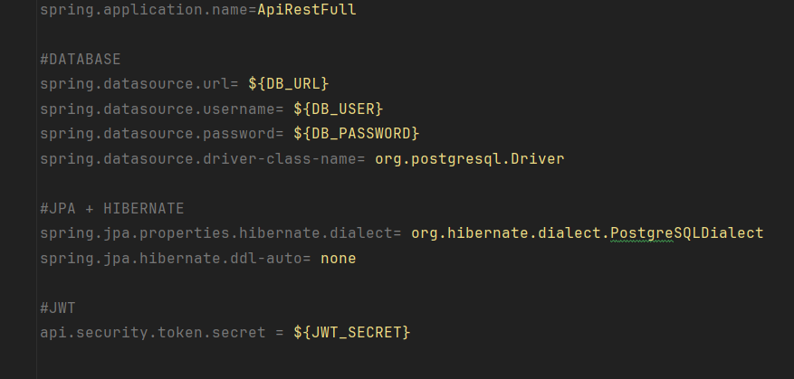

# 📚 API RestFull – Estudo com Spring Boot

Este projeto foi desenvolvido como **caso de estudo** para consolidar conhecimentos com as principais ferramentas do ecossistema Spring. Ele oferece uma API RESTful com autenticação stateless usando **JWT**, além de CRUD completo para usuários e produtos.

---

## 🚀 Funcionalidades

- ✅ Cadastro, listagem, atualização e exclusão de usuários
- ✅ Cadastro, listagem, atualização e exclusão de produtos
- ✅ Autenticação de usuários com **token JWT**
- ✅ Proteção de endpoints com **Spring Security**
- ✅ Separação clara entre DTOs e entidades usando **MapStruct**
- ✅ Versionamento de banco de dados com **Flyway**

---

## 🛠️ Tecnologias utilizadas

| Tecnologia        | Descrição                                  |
|-------------------|--------------------------------------------|
| Java 17           | Linguagem principal                        |
| Spring Boot       | Framework principal da aplicação           |
| Spring Security   | Autenticação e autorização de endpoints    |
| JWT               | Geração e validação de token de acesso     |
| JPA + Hibernate   | Persistência de dados                      |
| MapStruct         | Conversão entre DTOs e Entidades           |
| PostgreSQL        | Banco de dados relacional                  |
| Flyway            | Versionamento e migração do banco de dados |
| Maven             | Gerenciador de dependências e builds       |

---

## ⚙️ Como executar localmente

1. **Clone o repositório**
```bash
git clone https://github.com/mateus-mendess/product-api
cd https://github.com/mateus-mendess/product-api
```
2. **Configure o banco de dados PostgreSQL**

Ajuste o arquivo `application.properties` com os dados do seu banco:


